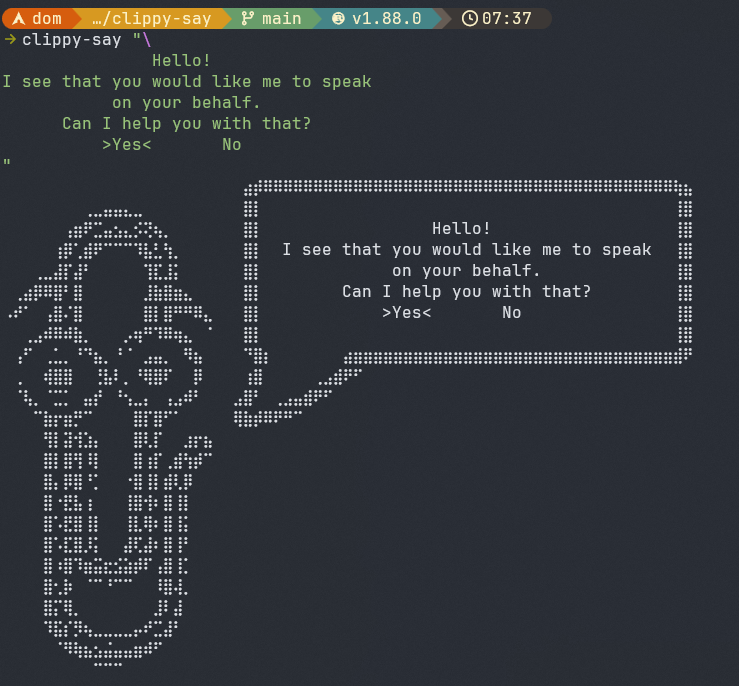
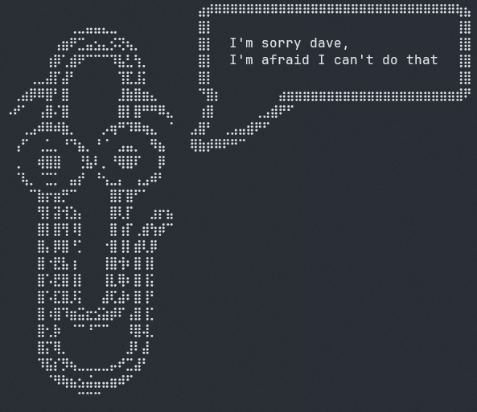
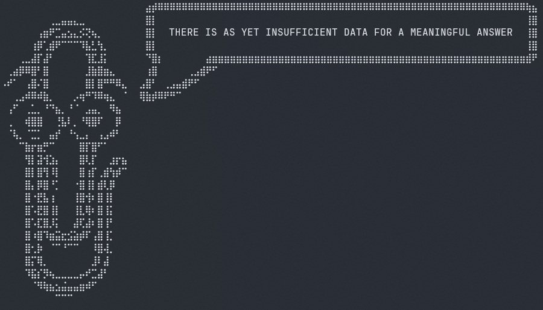

# clippy-say

Cowsay but for your favorite annoying paperclip.

This tool can be used both as a library for utilizing in your Rust code or as a
command line tool.



## Installation

## Command Line

```bash
cargo install --features cli clippy-say
```

## Library

```bash
cargo add clippy-say
```

## Usage

### Command Line

You can either use multiline strings in bash or use newline escapes: `\n`.

```bash
$ cargo install clippy-say
$ clippy-say "I'm sorry dave,\nbut I'm afraid I can't do that."
```

#### Output



### Library

```rust
use clippy_say::clippy_say;

fn main() {
    println!("{}", clippy_say("THERE IS AS YET INSUFFICIENT DATA FOR A MEANINGFUL ANSWER"));
}
```

```
$ cargo run
```

#### Output



## Caveats

Currently you have to format the input string yourself. The speech bubbles
width is tied to the length of the longest string in your input. The height
of the speech bubble is tied to the number of newlines in your input. All input
is left justified. Any other justification currently needs to be added manually
to the input before submission to Clippy.

## Future Features

- Justification
    - Left
    - Center
    - Right
- Max width tied to terminal frame width
- Automatic formatting of text from one to multiple lines.

## Contribution

Contributions are welcome 😁

Just fork the repo, make your changes, and submit your pull request!
